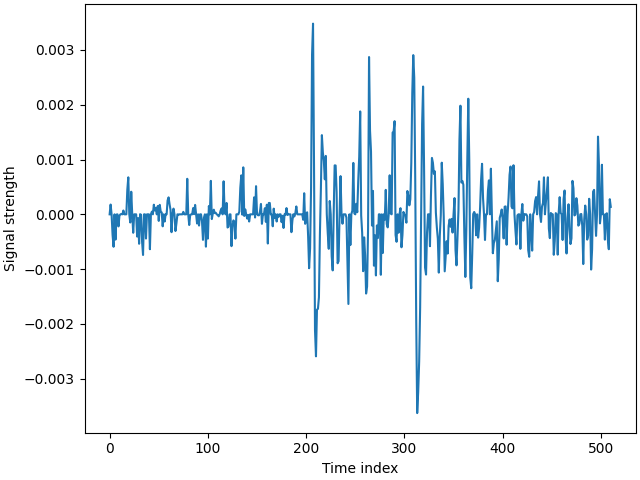
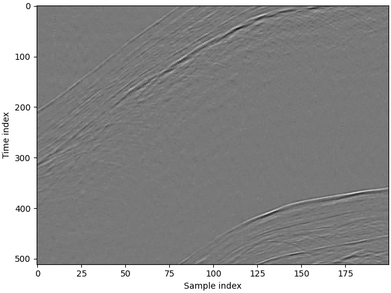
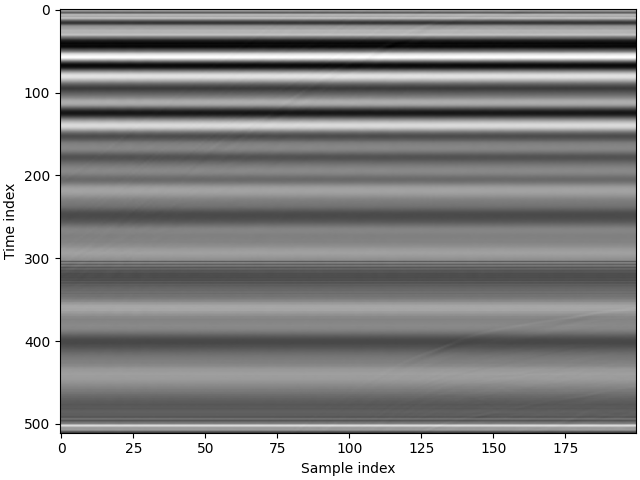
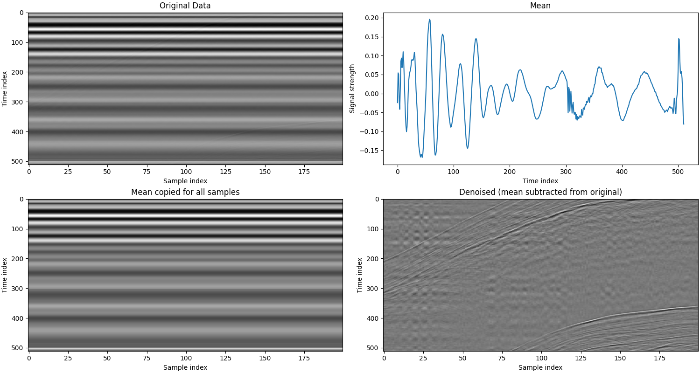
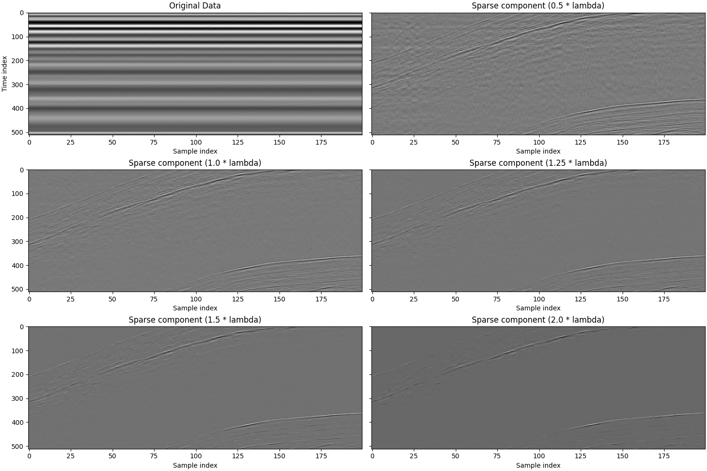

# Snow radar denoising using robust principal component analysis
This is a write-up of a small signal processing project I did. It explains the thought process I went through, and introduces robust principal component analysis: the problem of seperating a data matrix to a linearly regular part and a sparse, mostly empty part. I hope to encourage other scientists and engineers to explore the recently growing field of sparse and low-rank optimization, as it may prove surprisingly effective for seemingly difficult tasks.

## The problem
The Norwegian Meteorological Institute researches methods of measuring snow depth on sea ice. In one of their project a drone with a radar used so fly over the ice, sending and receiving radar signals. An example of one of these 'waveforms':

You can stack multiple waveforms to create an image, where pixel intensity represents signal strength:

However, in reality the signal is extremely noisy. You can barely see the signal.

This happens because the used antennas are not very directional, nor shielded well. Sent signals are waves reflected by the drone are caught by the receiving antenna. The data needs to be preprocessed before the underlying signal can be analyzed.

## Method 1: Naive mean subtraction
Most of the noise is caused by the measurement instrument itself. That is great, because it is invariant of the measurement location, meaning there should be great correlation between the noise in every waveform.

I start with the naive approach of assuming the noise is equal between each waveform and estimating it by averaging all waveforms. I then subtract this noise from each waveform. See script 'denoise_mean.py'. This leads to the following result:

The latent signal is clearly better visible, but some of the noise remains.

## Method 2: Principal component subtraction
TODO PCA method by rolf-ole

## Mathod 3: Robust princical component analysis
TODO RPCA

## References
1.  [R.-O. R. Jenssen. Snow depth from UAV GPR. Norwegian Meteorological Institute (2023).](https://doi.org/10.21343/ZAW8-2G80) Raw, unprocessed data was used, not publicly published. Data here is closest available dataset. Data in repository is small subset used as example.
2.  [Emmanuel J. Candès, Xiaodong Li, Yi Ma, John Wright. Robust principal component analysis? Association for Computing Machinery 2011.](https://doi.org/10.1145/1970392.1970395) (preprint on [arXiv](https://doi.org/10.48550/arXiv.0912.3599))
3.  [A. C. Stuurman (me). github.com/surgura/PyRPCA v1.0.0, Robust PCA for Python.](https://github.com/surgura/PyRPCA)
