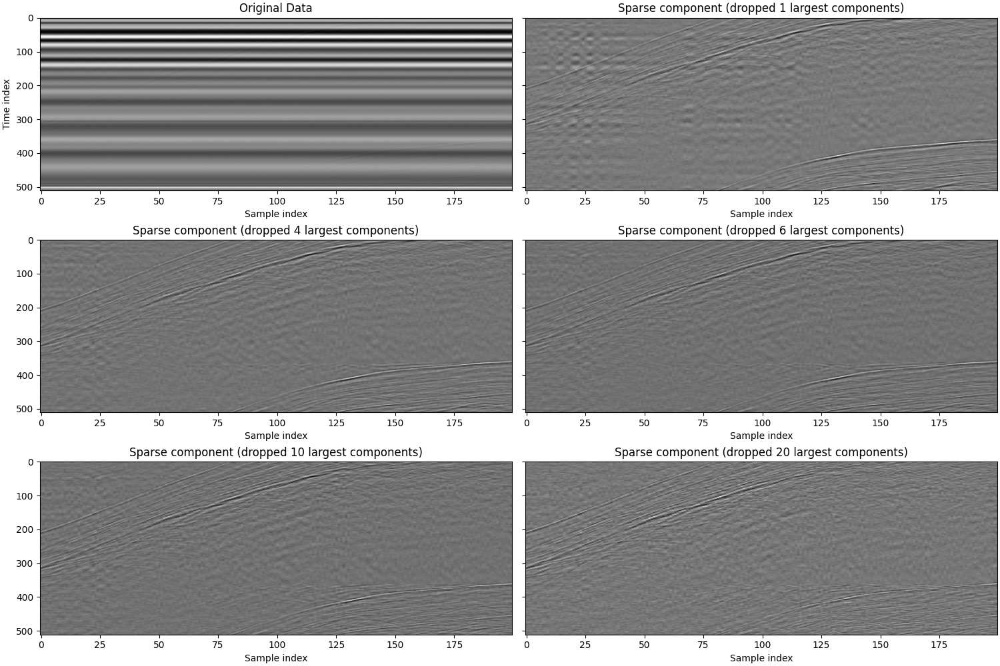

# Snow radar denoising using robust principal component analysis
This is a write-up of a small signal processing project I did. It explains the thought process I went through, and introduces robust principal component analysis: the problem of seperating a data matrix to a linearly regular part and a sparse, mostly empty part. I hope to encourage other scientists and engineers to explore the recently growing field of sparse and low-rank optimization, as it may prove surprisingly effective for seemingly difficult tasks.

## The problem
The Norwegian Meteorological Institute researches methods of measuring snow depth on sea ice. In one of their project a drone with a radar used so fly over the ice, sending and receiving radar signals. An example of one of these 'waveforms':

You can stack multiple waveforms to create an image, where pixel intensity represents signal strength:

However, in reality the signal is extremely noisy. You can barely see the signal.

This happens because the used antennas are not very directional, nor shielded well. Sent signals are waves reflected by the drone are caught by the receiving antenna. The data needs to be preprocessed before the underlying signal can be analyzed.

## Method 1: Naive mean subtraction
Most of the noise is caused by the measurement instrument itself. That is great, because it is invariant of the measurement location, meaning there should be great correlation between the noise in every waveform.

I start with the naive approach of assuming the noise is equal between each waveform and estimating it by averaging all waveforms. I then subtract this noise from each waveform. See script 'denoise_mean.py'. This leads to the following result:

The latent signal is clearly better visible, but some of the noise remains.

## Method 2: Principal component subtraction
The current method used at the Norwegian Meteorological Institute is to apply principal component analysis (PCA) and drop the first few principal components. This makes sense, as PCA find the linear relationships in the data, and the noise is definitely correlated between samples. The script 'denoise_pca' implements this approach, and provides the following result:

This look better than simply subtracting the noise. The result is even tunable with the number of principal components dropped. However, noise still remains, and dropping too many components starts degrading the signal, instead of removing more noise.

## Mathod 3: Robust princical component analysis
The latent signal we are dealing with is small compared to the noise. This mean we have to extract it using different features than magnitude. From the previous two methods we conclude than the noise is regular and spread throughout the complete picture. The latent signal, however, differs quite a lot between each sample. Additionally, it only encompasses a small part of the image (we call this sparse).

In recent years a new technique has become popular, called Robust Principal Component Analysis (RPCA). This algorithm seperates a matrix in two parts: one is sparse (many entries are zero) and one is low-rank (rows are highly correlated; there is a lot of linear structure). Our noise is clearly low-rank, as our linear methods of mean subtraction and PCA already work quite well. The latent signal is also quite sparse, as can be seen from our preliminary results. This makes our problem a perfect target for RPCA.

RPCA is actually only the description of the matrix seperation problem to solve and multiple algorithms exist to find or approximate solutions. I implemented a simple Python package for RPCA[[3]](#stuurmanpyrpca). See its repository for algorithmic details. There is no need to understand this level of detail, but for those interested, in this project I used the PCP convex relaxation solved by IALM.

There is only a single important parameter for RPCA, called 'lambda'. It determines the important of sparsity compared to low-rankness. I explored multiple values of lambda in the script 'denoise_rpca.py', the results of which can be seen below.

I think RPCA extracts the underlying signal extremely well. It is easily tuned by a single parameter, which also has obvious results. Lower values permit more noise, and higher values demand high sparsity, which is a clear and visible trade-off. The only downside of RPCA is that it is an optimization problem, which means it can sometimes take quite some time to run. However, in this case the matrix is quite small and the program runs fast. There are also various methods of improving performance, such as running it on seperate parts of the data (even in parallel), as well as various other optimization methods than or improved version of IALM.

## Conclusion
* RPCA works great for this use case.
* Although it can be slow, this can often be circumvented by various technioques.
* Think about it the next time your data is noisy.

## References
1.  [R.-O. R. Jenssen. Snow depth from UAV GPR. Norwegian Meteorological Institute (2023).](https://doi.org/10.21343/ZAW8-2G80) Raw, unprocessed data was used, not publicly published. Data here is closest available dataset. Data in repository is small subset used as example.
2.  [Emmanuel J. Candès, Xiaodong Li, Yi Ma, John Wright. Robust principal component analysis? Association for Computing Machinery 2011.](https://doi.org/10.1145/1970392.1970395) (preprint on [arXiv](https://doi.org/10.48550/arXiv.0912.3599))
3.  [A. C. Stuurman (me). github.com/surgura/PyRPCA v1.0.0, Robust PCA for Python.](https://github.com/surgura/PyRPCA)
